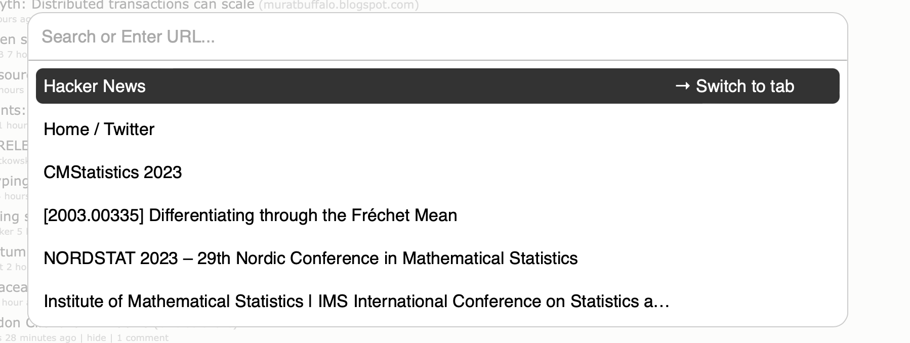

# Safari Cmd+Shift+p

A Safari extension that brings up a command bar with a search input when pressing `Cmd+Shift+P`, just like in Visual Studio Code. The command bar allows you to switch between open tabs, perform actions, and search your browser history.

## Usage

1. Press `Cmd+Shift+P` to open the command bar.
2. Start typing to search for open tabs, actions, and browser history.
3. Use the arrow keys to navigate through the search results.
4. Press `Enter` to perform an action or open a tab/history item.
5. Press `Esc` to close the command bar.

## Installation

1. Clone or download this repository.
2. In Safari, go to `Preferences` > `Extensions`.
3. Click on the `+` button to add a new extension.
4. Navigate to the downloaded/cloned repository and select the `SafariCmdShiftP Extension` folder.
5. Enable the extension in the extensions list.

## License

This project is licensed under the MIT License. See the [LICENSE](LICENSE) file for more information.
